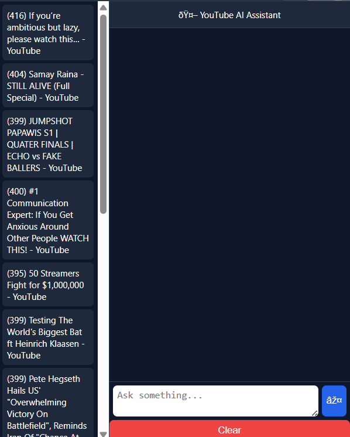
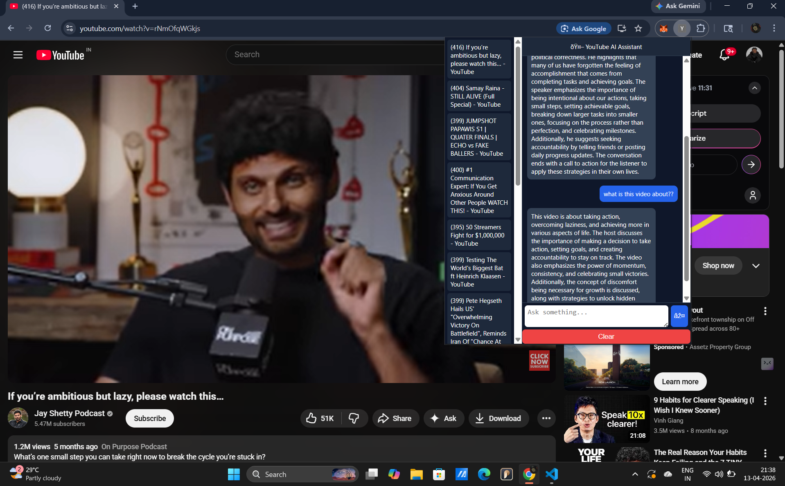

# 🎥 YouTube AI Chatbot (RAG-Based)

An AI-powered Chrome extension that lets you **ask questions about any YouTube video** using Retrieval-Augmented Generation (RAG).

---

## 🚀 Features

* 🔍 Ask questions about any YouTube video
* ⚡ Fast responses using **Phi-3 Mini (Ollama)**
* 🧠 Context-aware answers from video transcript
* 💬 Clean ChatGPT-like UI
* 📂 Chat history saved per video
* ⛔ Stop response generation
* ⚡ Optimized for fast local performance

---

## 🖥️ UI Preview

<p align="center">
  
</p>

---

## 💬 Chat Example

<p align="center">
  
</p>

---

## 🧠 How It Works

1. Extract YouTube video transcript
2. Split text into smaller chunks
3. Convert chunks into embeddings (vector form)
4. Store embeddings in FAISS vector database
5. Retrieve relevant chunks based on question
6. Phi-3 Mini generates answers using retrieved context

---

## 🧠 Tech Stack

* **Backend:** FastAPI
* **LLM:** Ollama (Phi-3 Mini)
* **Embeddings:** HuggingFace (MiniLM)
* **Vector DB:** FAISS
* **Frontend:** Chrome Extension (HTML, CSS, JavaScript)

---

## ⚡ Performance Optimizations

* ✅ Lightweight Phi-3 Mini model for fast inference
* ✅ Reduced chunk size for quicker retrieval
* ✅ FAISS caching for repeated queries
* ✅ Optimized prompt design for faster responses

---

## 🛠️ Setup

```bash
git clone https://github.com/your-username/youtube-rag-chatbot.git
cd youtube-rag-chatbot/backend
pip install -r requirements.txt
uvicorn app:app --reload
```

---

## 🧪 Usage

1. Open YouTube
2. Play any video
3. Open the Chrome extension
4. Ask your question

---

## 🔥 Example Questions

* What is this video about?
* Summarize the key points
* Explain the main concept
* What are the important topics covered?

---

## 📂 Project Structure

```
youtube-rag-chatbot/
│
├── backend/        # FastAPI + RAG logic
├── extension/      # Chrome extension UI
├── assets/         # Images used in README
│   ├── ui.png
│   ├── chat.png
│
└── README.md
```

---

## 👨‍💻 Author

**Tarun M**


---

## 📜 License

This project is developed for educational and research purposes.

---

## 💡 Tagline

**Turn any YouTube video into an interactive AI conversation.**
